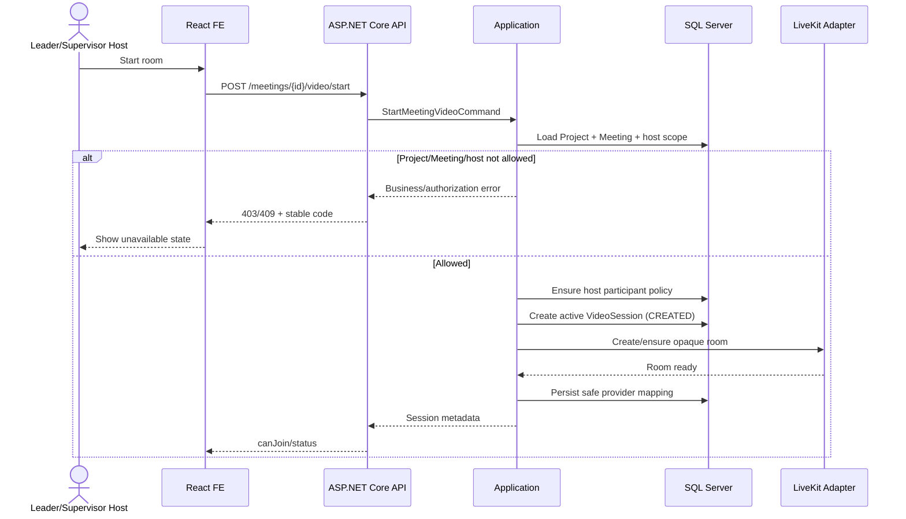
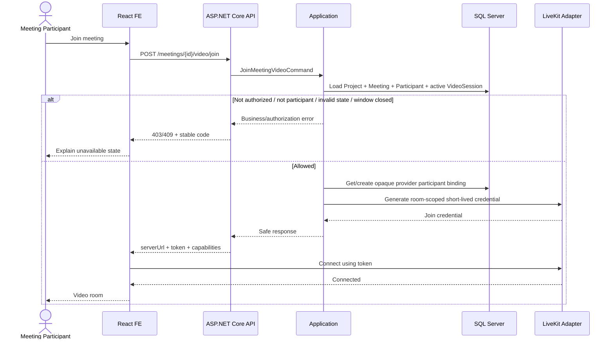
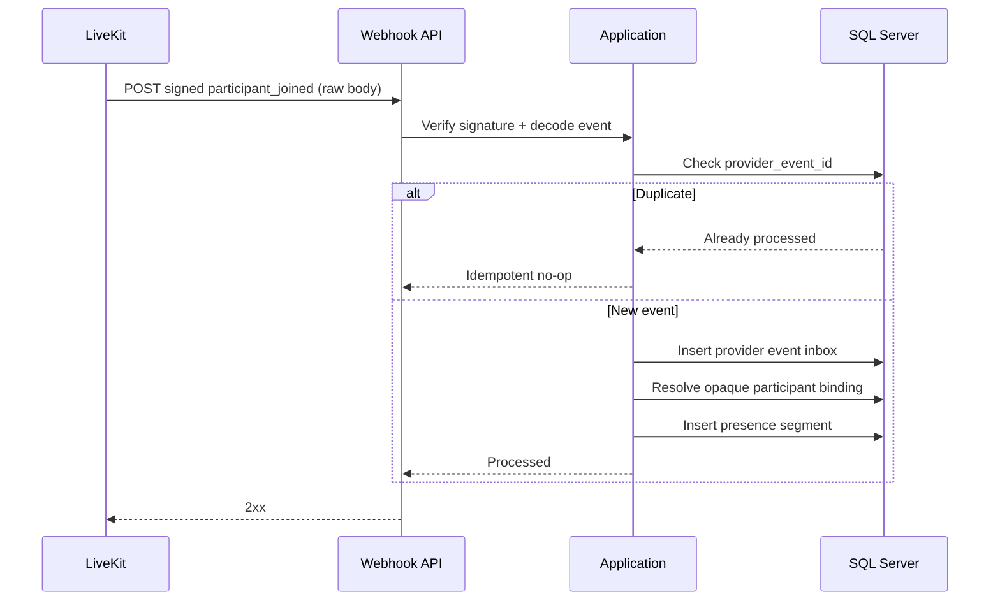
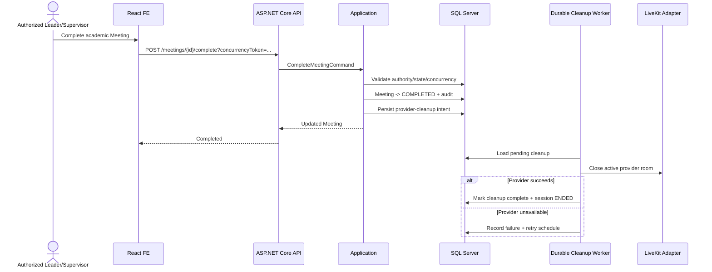

# AI-PMS Video Meeting Integration Contract v1.0 — FROZEN FOR IMPLEMENTATION

**Document type:** Frozen Technical Integration Contract / BE-FE Delivery Plan
**Contract version:** `v1.0`  
**Target project:** AI-PMS — AI-Powered Multi-disciplinary and Multi-major Academic Project Progress Management System  
**Frontend repository:** `aipms-sep490/ai-pms-frontend`  
**Backend repository:** `aipms-sep490/ai-pms-backend`  
**Frontend `develop` baseline audited:** `c9635cb7a3814a578a839d0295f0cf644b9da003`  
**Backend `develop` baseline audited:** `040361c4f7c0529bbcfcddf484e923fa826d4f85`  
**Review date:** 2026-10-02  
**Status:** `FROZEN FOR IMPLEMENTATION` — business/technical contract approved; implementation has not started  
**Primary provider:** LiveKit behind an AI-PMS provider abstraction  
**Alternative:** External meeting link or another provider adapter if deployment constraints require it

> **Baseline note:** The commit hashes above are repository baselines used for the original audit. Before implementation, BE and FE must re-audit their actual working branches/worktrees so this document does not overwrite newer Phase 2/Phase 3 changes.

> **Provider verification note:** LiveKit's current documentation confirms room-scoped JWT grants, backend-signed permissions, signed webhooks with event IDs, React components for camera/microphone/screen share, and Egress outputs to supported object storage. Provider-specific behavior remains Infrastructure concern; AI-PMS Backend remains the business authority.

## Contract freeze outcome

The original guideline was directionally correct, especially on Backend authority, provider abstraction, short-lived credentials, signed webhooks, presence as evidence, and separating Meeting business state from realtime media state. This reviewed version corrects the following design risks before implementation:

1. **Hybrid meetings are preserved.** A single mutually exclusive `OFFLINE / EXTERNAL_LINK / IN_APP_VIDEO` enum can regress the current ability to have physical location and online participation together.
2. **Room lifecycle is explicit.** Host `start`, participant `join`, and room `end` are separate from `Meeting.Status`.
3. **Video authorization is resource-scoped.** Being a Leader, Supervisor, or Admin does not automatically grant room access.
4. **Meeting participants remain the attendance ledger.** Host privileges must not bypass the participant relationship silently.
5. **Multiple technical sessions are allowed historically.** Only one active video session may exist per Meeting at a time.
6. **Presence has its own immutable connection history.** Reconnects create multiple presence segments.
7. **Recording is planned as a separate delivery phase** with explicit storage, consent, playback and state management; it is not silently mixed into the first MVP.
8. **Checkpoint semantics remain separate.** A Video Meeting does not become or auto-complete an academic Checkpoint.
9. **No assumption that an Outbox already exists.** Provider cleanup must be retryable and durable, using existing infrastructure if available or a narrowly scoped integration-job mechanism if not.
10. **Resource capabilities are returned by Backend.** FE uses `canStart/canJoin/canEnd/canRecord` and stable denial codes; it does not infer media authority from roles or routes.
11. **Group Calendar / Meeting History is a projection of Meeting.** Completed/cancelled meetings remain visible in the project/team calendar and open the same Meeting Detail/history; no separate `CalendarMeeting` or `VideoMeeting` aggregate is introduced.
12. **BE OpenAPI + frozen enums/DTOs/error codes are the canonical BE-FE contract.** Neither repository may silently rename fields, reinterpret states, or infer permissions after freeze.

---

## 1. Purpose

This document defines a synchronized Backend and Frontend implementation direction for adding **in-app Video Meeting** to AI-PMS without breaking the existing Meeting business workflow.

The goal is **not** to replace the current Meeting domain with a video-call product. The video room is an execution channel attached to the existing academic Meeting aggregate.

The existing AI-PMS Meeting remains the source of truth for:

- project association;
- meeting title, agenda, time window and organizer;
- invited participants;
- meeting status;
- attendance;
- meeting notes/minutes;
- supervisor feedback;
- meeting decisions;
- meeting action items;
- concurrency and authorization.

The video provider is responsible only for realtime media transport and realtime room state.

The core architectural rule is:

```text
AI-PMS Meeting Business State
            +
AI-PMS Authorization / Project Scope
            +
Short-lived Provider Access Token
            =
Allowed Video Session Access
```

The provider must never become the authority for AI-PMS roles, Project state, Meeting status, academic attendance, assessment or project governance.

---

## 2. Current AI-PMS Meeting Baseline

The current Backend already supports:

- `GET /api/v1/projects/{projectId}/meetings`
- `POST /api/v1/projects/{projectId}/meetings`
- `GET /api/v1/meetings/{id}`
- `PUT /api/v1/meetings/{id}`
- `POST /api/v1/meetings/{id}/cancel`
- `POST /api/v1/meetings/{id}/complete`
- `PUT /api/v1/meetings/{id}/notes`
- `POST /api/v1/meetings/{id}/participants`
- `DELETE /api/v1/meetings/{id}/participants/{userId}`
- `POST /api/v1/meetings/{id}/feedback`
- `GET/POST /api/v1/meetings/{meetingId}/decisions`
- `GET/POST /api/v1/meetings/{meetingId}/action-items`
- `PUT/PATCH /api/v1/meetings/{meetingId}/action-items/{id}`

The existing `MeetingDto` and `MeetingDetailDto` already contain:

```text
Id
ProjectId
Title
Agenda
MeetingNotes
StartAt
EndAt
Location
OnlineUrl
Status
CreatedBy
Participants
Feedbacks
ConcurrencyToken
Minutes
Decisions
Blockers
```

The existing execution governance baseline already provides optimistic concurrency for Meeting mutations and defines meeting decisions and action items.

Therefore, Video Meeting should be implemented as an **additive extension** to Meetings instead of a separate standalone meeting module.

---

## 3. Recommended Product Scope

### 3.1 Model physical delivery and video channel separately

Do **not** use a single mutually exclusive enum that forces a Meeting to be only physical, external-online, or in-app-online. AI-PMS should preserve hybrid meetings.

Recommended model:

```text
meeting_delivery_mode
---------------------
ONSITE
REMOTE
HYBRID

video_channel
-------------
NONE
EXTERNAL_LINK
IN_APP_VIDEO
```

Supported combinations:

| Delivery mode | Video channel | Meaning |
|---|---|---|
| `ONSITE` | `NONE` | Physical-only meeting |
| `REMOTE` | `EXTERNAL_LINK` | Remote meeting using Google Meet / Teams / Zoom / other external link |
| `REMOTE` | `IN_APP_VIDEO` | Remote meeting inside AI-PMS |
| `HYBRID` | `EXTERNAL_LINK` | Physical location + external online room |
| `HYBRID` | `IN_APP_VIDEO` | Physical location + AI-PMS video room |

Rules:

- `location` is required for `ONSITE` and `HYBRID`.
- `onlineUrl` is allowed only when `video_channel = EXTERNAL_LINK`.
- AI-PMS provider room identity is server-managed when `video_channel = IN_APP_VIDEO`.
- A provider join token is never persisted in Meeting data.
- Legacy rows must be normalized by an explicit migration/backfill, not inferred forever in application code.

Legacy backfill guidance:

```text
Location present + OnlineUrl null      -> ONSITE + NONE
Location null + OnlineUrl present      -> REMOTE + EXTERNAL_LINK
Location present + OnlineUrl present   -> HYBRID + EXTERNAL_LINK
Neither present                        -> requires data review / controlled default
```

### 3.2 Video MVP scope

The first Video Meeting delivery should provide:

- create/update a Meeting using `video_channel = IN_APP_VIDEO`;
- authorized host starts the in-app room;
- invited/eligible participant joins from Meeting Detail;
- microphone and camera;
- screen sharing;
- participant list;
- reconnect state;
- leave room;
- host/moderator grants issued by Backend;
- AI-PMS agenda/minutes/decisions/action items remain usable before, during and after the call;
- server-side provider events persisted as presence evidence;
- room end independent from academic Meeting completion;
- recording **off by default**.

### 3.3 Not in the first Video MVP

The first delivery should not include:

- AI-generated official minutes;
- automatic official attendance finalization;
- mandatory recording;
- transcription;
- phone/SIP dial-in;
- breakout rooms;
- a second persistent chat system;
- automatic grade/contribution changes from video presence;
- automatic Checkpoint completion.

Recording is defined later in this document as an explicit follow-up phase so the project can add it without redesigning Meeting.

---

## 4. Technology Direction

### 4.1 Recommended choice: LiveKit

Use **LiveKit** as the first provider behind an AI-PMS abstraction.

Why it is a strong fit for AI-PMS:

- WebRTC-based audio/video/screen sharing;
- React SDK suitable for the current React frontend;
- participant permissions are encoded in server-generated access tokens;
- backend can issue room-specific short-lived tokens;
- room/participant events are available through signed webhooks;
- recording can be added later through Egress without changing the core Meeting domain;
- supports managed cloud or self-hosted deployment;
- the media stream goes directly between the client and LiveKit infrastructure instead of through ASP.NET Core.

Important security rule:

**The LiveKit API secret must exist only on Backend/server infrastructure.**

The React application must never receive the API secret or generate LiveKit JWTs itself.

### 4.2 Provider abstraction

Do not couple Application/Domain logic directly to LiveKit.

Recommended backend abstraction:

```csharp
public interface IVideoMeetingProvider
{
    Task<VideoJoinCredential> CreateJoinCredentialAsync(
        VideoJoinRequest request,
        CancellationToken cancellationToken);

    Task CloseRoomAsync(
        string providerRoomKey,
        CancellationToken cancellationToken);

    Task<VideoRoomSnapshot?> GetRoomAsync(
        string providerRoomKey,
        CancellationToken cancellationToken);
}
```

Infrastructure implementation:

```text
IVideoMeetingProvider
        |
        +-- LiveKitVideoMeetingProvider
        |
        +-- Future Jitsi/JaaS adapter if required
```

Business authorization must be performed before calling the provider.

---

## 5. Domain Design

### 5.1 Keep academic Meeting state independent from realtime state

Existing academic Meeting state remains:

```text
SCHEDULED
COMPLETED
CANCELLED
```

Realtime room/session state is separate:

```text
CREATED
LIVE
ENDED
FAILED
```

If no `meeting_video_sessions` row exists yet, the room is effectively `NOT_STARTED`; do not persist a fake `NOT_STARTED` session unless needed for an operational reason.

Key rules:

- `LIVE` must **not** be added to the existing Meeting status.
- `room_finished` must **not** automatically complete the academic Meeting.
- provider failure must **not** corrupt the Meeting lifecycle;
- completing/cancelling a Meeting stops new video credentials and schedules provider cleanup;
- ending a room is a technical operation; completing a Meeting remains an authorized business action.

### 5.2 One active technical session, multiple historical sessions

A Meeting may need a new technical provider session after a provider failure, reset, or controlled restart.

Therefore:

```text
Meeting 1 ---- * MeetingVideoSession
```

but only one session can be active at a time.

Recommended active set:

```text
CREATED
LIVE
```

Enforce "at most one active session per Meeting" with a database constraint/index appropriate for SQL Server rather than `meeting_id UNIQUE`.

### 5.3 Video channel is not Meeting governance

Video is an execution channel attached to Meeting. It does not replace:

- MeetingParticipant;
- official attendance;
- minutes;
- decisions;
- action items;
- supervisor feedback;
- project authorization;
- Project state;
- academic Checkpoint.

A normal Video Meeting remains a Meeting. If a governance Checkpoint requires evidence/confirmation, the Checkpoint workflow must still be satisfied independently.

### 5.4 Freeze the authoritative governance record before AI/video automation

The current system already exposes Meeting governance APIs. Video UI must reuse those APIs and must not create a second persistence model for decisions or action items.

Before later AI transcription/auto-drafting is enabled, Backend should explicitly document which representation is authoritative where current schema/service models overlap (for example structured decision/action records versus summary text fields). This is not a blocker for basic video join, but it is a prerequisite for reliable AI extraction.

---

## 6. Recommended Database Changes

Use additive, rerunnable migrations. Do not modify generated/database-first models manually if the repository's generation workflow expects regeneration.

### 6.1 Extend `meetings`

Recommended transitional fields:

```sql
ALTER TABLE dbo.meetings ADD
    meeting_delivery_mode NVARCHAR(20) NULL,
    video_channel         NVARCHAR(30) NULL;
```

Target values:

```text
meeting_delivery_mode: ONSITE | REMOTE | HYBRID
video_channel:         NONE | EXTERNAL_LINK | IN_APP_VIDEO
```

Backfill legacy rows first; only then make fields `NOT NULL` if the data is fully normalized.

Do not use `online_url` for an AI-PMS provider room.

### 6.2 Add `meeting_video_sessions`

Recommended logical shape:

```text
meeting_video_sessions
----------------------
id
meeting_id
provider                    -- LIVEKIT
provider_room_key           -- opaque, UNIQUE
status                      -- CREATED/LIVE/ENDED/FAILED
started_by                  -- nullable until actually started
started_at
ended_at
failure_code
created_at
updated_at
concurrency_token
```

Rules:

- `meeting_id` is **not globally UNIQUE**;
- enforce at most one active (`CREATED`/`LIVE`) session per Meeting;
- room key is opaque and contains no PII;
- do not persist provider access tokens.

Example room key:

```text
vm-9d8b37c4a08e4ddf
```

### 6.3 Add provider participant binding

Webhook processing needs a safe way to map an opaque provider identity back to an AI-PMS user.

Recommended:

```text
meeting_video_participant_bindings
----------------------------------
id
meeting_video_session_id
user_id
provider_participant_identity   UNIQUE
created_at
```

Recommended uniqueness:

```text
UNIQUE(meeting_video_session_id, user_id)
```

This avoids putting name/email/student code into provider identity.

### 6.4 Add participant presence history

Recommended:

```text
meeting_video_presence_sessions
-------------------------------
id
meeting_video_session_id
user_id
provider_participant_identity
provider_connection_id         -- nullable if provider does not expose a stable one
joined_at
left_at
disconnect_reason
created_at
updated_at
```

A reconnect creates another row/segment. Do not overwrite the previous interval.

Backend can aggregate:

```text
first_join_at
last_leave_at
total_connected_seconds
connection_count
```

### 6.5 Add webhook idempotency inbox

Recommended:

```text
video_provider_events
---------------------
id
provider
provider_event_id             UNIQUE
event_type
meeting_video_session_id
received_at
processed_at
payload_hash
processing_status
error_code
```

Do not retain raw provider payload indefinitely unless an explicit operational/audit requirement justifies it.

### 6.6 Recording metadata — follow-up phase

When recording is enabled, add a dedicated table rather than attaching binary data to Meeting:

```text
meeting_recordings
------------------
id
meeting_id
meeting_video_session_id
provider
provider_recording_id
status                       -- STARTING/RECORDING/PROCESSING/READY/FAILED
storage_provider
storage_object_key
mime_type
duration_seconds
file_size_bytes
started_by
started_at
ended_at
ready_at
failure_code
created_at
updated_at
concurrency_token
```

Never store large recording binaries in SQL Server.

Playback must use an authenticated endpoint that returns a short-lived signed/private URL or streams through an authorized storage abstraction. Never store a permanent public recording URL.

---

## 7. Attendance Rule

The current Meeting domain already has `MeetingParticipant` and official attendance state.

Video presence is **evidence**, not the official attendance decision.

Recommended flow:

```text
Signed provider join/leave events
        |
        v
Presence segments
        |
        v
Aggregated presence summary
        |
        v
Authorized Leader / Supervisor review
        |
        v
Existing MeetingParticipant.AttendanceStatus
```

Important rules:

- reconnects are aggregated from multiple immutable presence segments;
- React client events are never accepted as verified attendance;
- provider presence never overwrites official attendance automatically;
- no attendance percentage threshold is hardcoded unless academic policy explicitly defines it;
- without an approved threshold, UI should display raw duration/connection evidence and require human confirmation.

The existing attendance column currently carries both invitation-like states (`INVITED/ACCEPTED/DECLINED`) and final attendance-like states (`ATTENDED/ABSENT`). Video integration should **not** add more meanings to that column. If the team later wants distinct RSVP and attendance lifecycles, treat that as a separate schema refactor.

---

## 8. Authorization Model

Video authorization is resource-level and must be decided by Backend for every start/join/end/record request.

### 8.1 Start room

Recommended start conditions:

```text
Authenticated ACTIVE account
AND
Project is ACTIVE
AND
actor can access the Project
AND
Meeting.Status = SCHEDULED
AND
video_channel = IN_APP_VIDEO
AND
no other active MeetingVideoSession exists
AND
actor can manage/start this Meeting
```

The start actor should be one of the existing Meeting managers allowed by business policy (for example Meeting creator, current Student Leader, or active assigned Supervisor).

**Admin must not automatically receive media-room access merely because an existing administrative path can manage a Meeting record.** Administrative metadata access and private media participation are different permissions.

If a valid host is not yet a `MeetingParticipant`, choose one explicit policy and test it:

1. **Preferred:** `Start` transactionally ensures the authorized host is present in `MeetingParticipant`; or
2. reject start until the host is added through the normal participant workflow.

Do not silently bypass the participant ledger.

### 8.2 Join room

Recommended join conditions:

```text
Authenticated ACTIVE account
AND
Project is ACTIVE
AND
actor still has valid Project scope
AND
Meeting.Status = SCHEDULED
AND
video_channel = IN_APP_VIDEO
AND
actor is a MeetingParticipant
AND
an active video session exists
AND
join window is open
```

A Student Leader or assigned Supervisor does **not** get automatic join rights solely from the role/assignment if they are not part of the Meeting participant/host flow.

This rule preserves the SRS concept that Meeting participants are the authoritative attendance scope.

### 8.3 Join window

Join timing is Backend configuration/policy, not React logic.

Example only:

```text
Open: configurable minutes before StartAt
Close: configurable grace period after EndAt
```

Do not freeze `15 minutes before / 30 minutes after` as a business rule unless the project owner explicitly approves it.

### 8.4 Moderator capability

Moderator grants are computed server-side from the Meeting/resource policy.

Typical moderator candidates:

```text
authorized Meeting creator
authorized Student Leader
authorized active assigned Supervisor
```

but only when they are valid for the Meeting/session.

Provider grants can include:

- room administration;
- remove/mute participant where supported;
- room close;
- recording permission in the recording phase.

Student Member does not receive moderator grants merely because they are invited.

### 8.5 Frontend responsibility

Backend should return resource-level media capabilities such as:

```text
canStart
canJoin
canEnd
canRecord
denialReasons[]
```

Frontend may use them to fail closed and explain UX state.

Frontend must never infer authority from:

```text
global role name
current route
project page variant
"primary assignment" alone
client-tampered capability
```

Mutation endpoint authorization remains the final authority even when the UI hides/disables a control.

---

## 9. API Contract Proposal

### 9.1 Create/update Meeting

Extend existing Meeting request shape with delivery and video channel:

```json
{
  "title": "Sprint review",
  "agenda": "Review progress",
  "startAt": "2026-10-03T02:00:00Z",
  "endAt": "2026-10-03T03:00:00Z",
  "meetingDeliveryMode": "HYBRID",
  "videoChannel": "IN_APP_VIDEO",
  "location": "Lab 301",
  "onlineUrl": null,
  "participantUserIds": [10, 11, 35]
}
```

Validation examples:

```text
ONSITE + NONE
    location required
    OnlineUrl null

REMOTE + EXTERNAL_LINK
    OnlineUrl valid HTTPS
    location normally null

REMOTE + IN_APP_VIDEO
    OnlineUrl null
    provider room server-managed

HYBRID + EXTERNAL_LINK
    location required
    OnlineUrl valid HTTPS

HYBRID + IN_APP_VIDEO
    location required
    OnlineUrl null
    provider room server-managed
```

Business validation remains Backend authority.

### 9.2 Read Meeting / video resource access

Add safe video metadata to Meeting Detail or the video-session endpoint:

```json
{
  "id": 123,
  "meetingDeliveryMode": "REMOTE",
  "videoChannel": "IN_APP_VIDEO",
  "video": {
    "status": "CREATED",
    "provider": "LIVEKIT",
    "canStart": false,
    "canJoin": true,
    "canEnd": false,
    "canRecord": false,
    "joinAvailableFrom": "2026-10-03T01:45:00Z",
    "joinAvailableUntil": "2026-10-03T03:30:00Z",
    "denialReasons": []
  }
}
```

Never return provider API secret, admin secret, long-lived room token, or recording storage credentials.

### 9.3 Start endpoint

Recommended:

```http
POST /api/v1/meetings/{meetingId}/video/start
```

Responsibilities:

- authorize resource scope and Meeting manager;
- require `Project = ACTIVE`;
- require `Meeting = SCHEDULED`;
- ensure/validate host participation policy;
- create `meeting_video_sessions` lazily;
- create provider room if needed;
- return current safe session metadata.

Starting a room does **not** complete or otherwise transition the academic Meeting.

### 9.4 Join endpoint

Recommended:

```http
POST /api/v1/meetings/{meetingId}/video/join
```

The browser never sends requested provider permissions.

Optional request:

```json
{
  "deviceSessionId": "client-correlation-only"
}
```

`deviceSessionId` is correlation data only; never trust it for identity or authorization.

Response:

```json
{
  "provider": "LIVEKIT",
  "serverUrl": "wss://...",
  "participantIdentity": "vp-773cd3d4e32c4e10",
  "participantName": "Nguyễn Văn A",
  "accessToken": "short-lived-token",
  "expiresAt": "2026-10-03T01:51:00Z",
  "capabilities": {
    "publishAudio": true,
    "publishVideo": true,
    "screenShare": true,
    "moderator": false
  }
}
```

Token TTL should be short for initial connection. Token expiry protects initial/rejoin authorization; it is not the academic session duration.

Do not store the join token in:

- localStorage;
- sessionStorage;
- URL/query string;
- analytics;
- application logs.

### 9.5 End-room endpoint

Recommended:

```http
POST /api/v1/meetings/{meetingId}/video/end
```

Only authorized host/moderator actors can request room end.

Effects:

```text
video session -> ENDED
provider close requested
new joins denied for that session
Meeting.Status unchanged
```

A later controlled restart can create another session if policy permits and the Meeting remains `SCHEDULED`.

### 9.6 Session status endpoint

Recommended:

```http
GET /api/v1/meetings/{meetingId}/video/session
```

Return:

- active/latest video session state;
- safe provider name;
- `canStart/canJoin/canEnd/canRecord`;
- denial reasons;
- join window;
- active participant count if reliable.

Use LiveKit client state for realtime tiles/connection quality after the user is inside the room. Do not poll this endpoint as a replacement for the provider SDK.

### 9.7 Webhook endpoint

Recommended:

```http
POST /api/v1/integrations/video/livekit/webhook
```

Rules:

- not authenticated using AI-PMS user JWT;
- validate provider signature against the **raw request body**;
- use provider event ID for idempotency;
- resolve opaque room and participant identity;
- persist join/leave presence;
- handle room start/finish;
- tolerate duplicate delivery;
- tolerate missing/out-of-order events defensively;
- never auto-complete the academic Meeting.

### 9.8 Meeting complete/cancel and provider cleanup

When Meeting becomes `COMPLETED` or `CANCELLED`:

1. commit the academic business transition;
2. immediately deny issuance of new join credentials;
3. persist a retryable provider-cleanup intent;
4. close the provider room asynchronously;
5. retry transient provider failure;
6. never roll back the academic transition because LiveKit is unavailable.

Use an existing durable outbox/background-job mechanism if the backend already has one. If not, implement the smallest durable retry mechanism necessary for this integration; do not assume an Outbox exists.

### 9.9 Recording API — follow-up phase

When recording is enabled:

```http
POST /api/v1/meetings/{meetingId}/recordings
POST /api/v1/meetings/{meetingId}/recordings/{recordingId}/stop
GET  /api/v1/meetings/{meetingId}/recordings
GET  /api/v1/meetings/{meetingId}/recordings/{recordingId}/playback
```

Recording state:

```text
STARTING -> RECORDING -> PROCESSING -> READY
                               \-> FAILED
```

`playback` must authorize the current actor and return only short-lived/private access.

---


### 9.10 Presence evidence endpoint — frozen for MVP

Expose server-verified presence evidence for Meeting Detail/History:

```http
GET /api/v1/meetings/{meetingId}/video/presence
```

Authorization follows the existing Meeting/project read scope. This endpoint exposes **evidence**, not an attendance decision.

Recommended response:

```json
{
  "meetingId": 123,
  "participants": [
    {
      "userId": 10,
      "firstJoinedAt": "2026-10-03T02:01:12Z",
      "lastLeftAt": "2026-10-03T02:58:44Z",
      "totalConnectedSeconds": 3374,
      "connectionCount": 2
    }
  ]
}
```

Rules:

- aggregate across reconnect segments and, when a controlled restart occurred, across historical video sessions of the same Meeting;
- React/provider client events are never accepted as verified presence;
- no percentage threshold is returned as official attendance unless an academic policy explicitly defines one;
- official attendance continues to use the existing Meeting attendance workflow.


---

## 10. Backend Clean Architecture Placement

Recommended structure:

```text
AIPMS.Domain
└── Meeting / Video business concepts
    └── no LiveKit SDK dependency

AIPMS.Application
└── Features/Meetings/Video
    ├── Commands
    │   ├── StartMeetingVideo
    │   ├── JoinMeetingVideo
    │   ├── EndMeetingVideo
    │   └── ProcessVideoProviderEvent
    ├── Queries
    │   └── GetMeetingVideoSession
    ├── DTOs
    ├── Validators
    ├── Abstractions
    │   └── IVideoMeetingProvider
    └── Services
        └── authorization / session orchestration

AIPMS.Infrastructure
└── Video
    └── LiveKit
        ├── LiveKitVideoMeetingProvider
        ├── LiveKitOptions
        └── webhook verification adapter

AIPMS.Api
├── MeetingVideoController
└── VideoProviderWebhookController
```

Application/Domain code must not depend on provider SDK types.

Recommended provider abstraction:

```csharp
public interface IVideoMeetingProvider
{
    Task<VideoRoomResult> CreateRoomAsync(
        VideoRoomRequest request,
        CancellationToken cancellationToken);

    Task<VideoJoinCredential> CreateJoinCredentialAsync(
        VideoJoinRequest request,
        CancellationToken cancellationToken);

    Task CloseRoomAsync(
        string providerRoomKey,
        CancellationToken cancellationToken);

    Task<VideoRoomSnapshot?> GetRoomAsync(
        string providerRoomKey,
        CancellationToken cancellationToken);
}
```

Recording can be added later through a separate abstraction (for example `IVideoRecordingProvider`) so the basic room contract stays small.

All authorization happens before provider calls. Provider errors are mapped to stable AI-PMS application errors/ProblemDetails; FE must not parse LiveKit-specific failures.

---

## 11. Frontend Architecture

Recommended feature structure:

```text
src/features/meetings/
├── video/
│   ├── MeetingVideoRoomPage.tsx
│   ├── MeetingVideoPreflight.tsx
│   ├── MeetingVideoControls.tsx
│   ├── MeetingVideoState.tsx
│   ├── useMeetingVideoAccess.ts
│   ├── meeting-video-api.ts
│   ├── meeting-video.types.ts
│   ├── providers/
│   │   └── livekit/
│   │       ├── LiveKitRoomAdapter.tsx
│   │       └── livekit-ui.tsx
│   └── __tests__/
├── MeetingDetailPage.tsx
├── MeetingScheduleForm.tsx
├── MeetingGovernancePanel.tsx
└── ...
```

Rules:

- provider imports stay inside the provider adapter area;
- general Meeting components consume AI-PMS types, not LiveKit types;
- join token lives in memory only;
- normal Meeting Detail must not request camera/microphone permission;
- resource capability from Backend is fail-closed;
- direct-route access to the room still requires a fresh Backend join call.

Recommended packages for the LiveKit adapter are the current official React packages (`@livekit/components-react`, `@livekit/components-styles`, `livekit-client`) when implementation begins; pin versions through the repository's normal package-management policy.

---

## 12. Frontend UX Flow

### 12.1 Create/Edit Meeting

Recommended form separates physical delivery from video channel.

Example:

```text
Hình thức tham gia
( ) Tại chỗ
( ) Từ xa
( ) Kết hợp

Kênh trực tuyến (when REMOTE/HYBRID)
( ) Liên kết ngoài
( ) Video trong AI-PMS
```

Behavior:

```text
ONSITE + NONE
-> show Location

REMOTE + EXTERNAL_LINK
-> show Online URL

REMOTE + IN_APP_VIDEO
-> no Online URL
-> explain that AI-PMS creates the room

HYBRID + EXTERNAL_LINK
-> show Location + Online URL

HYBRID + IN_APP_VIDEO
-> show Location
-> no Online URL
-> AI-PMS provides the room
```

Frontend validates shape/required input only. Backend validates all business combinations.

### 12.2 Meeting Detail

For `IN_APP_VIDEO`, show safe Backend-derived state:

```text
Video meeting
Status: Chưa bắt đầu / Đang diễn ra / Đã kết thúc

[Start room]     -- only if canStart
[Join meeting]   -- only if canJoin
[End room]       -- only if canEnd
```

If unavailable, show a stable Backend-derived explanation such as:

```text
Cuộc họp chưa mở để tham gia.
Bạn không có trong danh sách người tham gia.
Dự án không còn ở trạng thái cho phép thực thi.
```

Do not construct these permission decisions from role names.

### 12.3 Preflight

Before requesting a join credential or immediately before connection:

- camera preview;
- microphone selector;
- camera selector;
- join muted;
- join with camera off;
- browser permission states;
- audio-only fallback;
- explicit Join action.

Do not request camera/microphone permission on ordinary Meeting Detail.

The final `join` API call should occur immediately before provider connection so the Backend can re-check resource state and issue a fresh short-lived credential.

### 12.4 Video room

Desktop concept:

```text
+-----------------------------------------------------+
| Meeting title       Connection state      Leave     |
+-----------------------------------------------------+
|                                                     |
|                  Video stage                        |
|                                                     |
+--------------------------------------+--------------+
| Mic | Cam | Share | Participants     | Governance   |
+--------------------------------------+--------------+
```

Governance drawer can reuse:

- agenda;
- `MeetingNotesForm`;
- `MeetingGovernancePanel`;
- decisions;
- action items.

Do not create a second decision/action system in LiveKit state.

### 12.5 Mobile

At 375px:

- video stage is the primary surface;
- controls remain reachable without horizontal scrolling;
- participants/governance use bottom sheet or drawer;
- no document-level horizontal overflow;
- landscape remains usable;
- leave/end actions remain distinct from ordinary media controls.

### 12.6 Recording UX — follow-up phase

When recording is enabled later:

- all participants receive a persistent visible recording indicator;
- only Backend-authorized actors see Start/Stop Recording;
- recording state comes from AI-PMS/Provider events;
- no FE-generated permanent playback URL;
- playback requires normal AI-PMS authorization.

---


### 12.7 Group Calendar / Meeting History — frozen contract

The project/team calendar is a **read projection of the existing Meeting aggregate**. It is not a new business aggregate.

Authoritative rule:

```text
Meeting = source of truth
Calendar / History = presentation projection of Meeting
VideoSession = technical child resource of Meeting
Presence = evidence child resource
Recording = optional future child resource
```

Do **not** create a separate `CalendarMeeting`, `VideoMeeting`, or duplicated meeting-history persistence model.

Calendar behavior:

```text
Meeting SCHEDULED + no LIVE video session
    -> Upcoming

Meeting SCHEDULED + active VideoSession LIVE
    -> Live (presentation badge only; Meeting.Status remains SCHEDULED)

Meeting SCHEDULED + latest VideoSession ENDED
    -> "Room ended / awaiting Meeting completion" presentation state

Meeting COMPLETED
    -> remains on the original scheduled date/time
    -> appears in Meeting History
    -> opens Meeting Detail/history

Meeting CANCELLED
    -> remains visible according to existing read scope
    -> displays Cancelled
```

The transient `Live` / `Awaiting completion` labels are **derived presentation state only**. They must never be persisted as new `Meeting.Status` values.

When an authorized actor opens a completed Meeting from the calendar/history, the page may show, according to existing access policy:

- title, agenda, schedule and location/delivery mode;
- participants;
- official attendance;
- meeting notes/minutes;
- decisions;
- blockers;
- action items;
- attachments/evidence;
- aggregated video presence evidence;
- recording entry only when the later Recording phase is enabled.

Existing Meeting mutation guards remain authoritative. A completed/archived Meeting must not become editable merely because it is opened from Calendar/History.

MVP data source:

```http
GET /api/v1/projects/{projectId}/meetings
GET /api/v1/meetings/{meetingId}
GET /api/v1/meetings/{meetingId}/video/session
GET /api/v1/meetings/{meetingId}/video/presence
```

The existing project Meeting list remains the canonical calendar source. Optional `from/to/status` filtering may be added later as a backward-compatible optimization; it must not create a second calendar source of truth.


---

## 13. Realtime and Persistence Responsibility

Use the provider SDK for realtime UI:

```text
camera
microphone
screen share
participant joined/left UI
connection quality
reconnect
```

Use AI-PMS Backend for persistent state:

```text
Meeting status
participant invitation
official attendance
minutes
decisions
action items
supervisor feedback
presence history
audit
```

Do not persist business records using provider client events directly from React.

---

## 14. Recording Strategy

Recording is a **separate Video Meeting delivery phase**, not a hidden extension of the first room MVP.

Default:

```text
recording = OFF
```

Before production enablement, freeze:

- who can start/stop recording;
- who can view/play/download;
- consent/notice UX;
- retention period;
- delete/archive policy;
- storage provider;
- audit requirements;
- whether recording is an academic record.

Recommended architecture:

```text
Authorized host
    |
    v
AI-PMS Backend start-recording command
    |
    v
LiveKit Egress
    |
    v
Supported private object storage
    |
    v
meeting_recordings metadata
    |
    v
Authorized short-lived playback
```

Current LiveKit Egress supports S3-compatible storage, Google Cloud Storage, Azure Blob Storage and Alibaba OSS. Do not assume the existing Google Drive file provider is a direct Egress target.

If AI-PMS wants Google Drive as the final repository, use a separate controlled transfer/import process after Egress, rather than pretending LiveKit writes directly to Drive.

Recording lifecycle:

```text
STARTING
  -> RECORDING
  -> PROCESSING
  -> READY

Any provider/storage failure
  -> FAILED
```

Recording completion is asynchronous. A successful "Stop" command does not mean the file is immediately ready.

Never:

- store recording binary in SQL Server;
- expose a permanent public URL;
- let React decide recording authority;
- auto-create official academic evidence from a recording without human/business confirmation.

---

## 15. Future AI Integration

AI can later assist with:

- transcript summarization;
- extracting proposed action items;
- identifying possible blockers;
- suggesting meeting minutes draft.

AI output must remain:

```text
DRAFT / SUGGESTION
```

Human actor must confirm before creating:

- official Meeting decision;
- official action item;
- official attendance;
- Project state transition;
- evaluation evidence.

Video AI must not replace Business Rules.

---

# 16. BE Work Breakdown

## BE-VM-01 — Freeze contract and schema

**Owner:** Backend Developer  
**Dependency:** none  
**Output:** approved DB/API contract

Tasks:

- freeze `meeting_delivery_mode` + `video_channel`;
- define legacy backfill;
- add `meeting_video_sessions`;
- add provider participant binding;
- add presence history;
- add webhook idempotency inbox;
- add constraints/indexes including one-active-session-per-Meeting;
- update DTOs;
- keep existing Meeting behavior compatible.

Acceptance:

```text
migration rerunnable
legacy meetings remain readable
hybrid meeting is supported
no provider SDK in Domain
no access token persistence
```

## BE-VM-02 — Provider abstraction and LiveKit adapter

**Dependency:** BE-VM-01

Tasks:

- implement `IVideoMeetingProvider`;
- implement LiveKit adapter in Infrastructure;
- configure server URL/API key/API secret/token TTL;
- create opaque room and participant identities;
- map provider errors to stable application errors;
- never expose API secret to FE.

Acceptance:

```text
Application depends on abstraction only
secret loaded from secure configuration
no PII in room/participant identity
provider mapping covered by tests
```

## BE-VM-03 — Video session lifecycle

**Dependency:** BE-VM-02

Implement:

```http
POST /api/v1/meetings/{id}/video/start
POST /api/v1/meetings/{id}/video/end
```

Rules:

- project ACTIVE;
- Meeting SCHEDULED;
- in-app video channel;
- authorized Meeting manager;
- at most one active session;
- start/end never auto-completes Meeting;
- explicit host-participant policy.

## BE-VM-04 — Join authorization and credential

**Dependency:** BE-VM-03

Implement:

```http
POST /api/v1/meetings/{id}/video/join
```

Validation:

```text
authenticated/active account
-> project ACTIVE + access
-> Meeting SCHEDULED
-> video channel IN_APP_VIDEO
-> actor is MeetingParticipant
-> active session exists
-> join window/policy
-> compute server-side media/moderator grants
-> issue short-lived credential
```

Acceptance:

- unrelated user 403;
- non-participant does not join merely due to global role;
- completed/cancelled meeting gets stable conflict/unavailable response;
- browser cannot request moderator privilege;
- Admin does not automatically gain room access;
- token never logged.

## BE-VM-05 — Video session read model

Implement:

```http
GET /api/v1/meetings/{id}/video/session
```

Return safe status plus:

```text
canStart
canJoin
canEnd
canRecord
denialReasons
join window
active participant count (if reliable)
```

Resource capability is informational/fail-closed; mutation endpoint still re-authorizes.

## BE-VM-06 — Signed webhook + presence

Events of interest:

```text
room_started
room_finished
participant_joined
participant_left
participant_connection_aborted
```

Tasks:

- verify signature against raw body;
- idempotency by provider event ID;
- resolve opaque room/participant mapping;
- persist presence segment;
- close open presence on room end;
- tolerate duplicates and defensive out-of-order cases.

Acceptance:

- duplicate event does not duplicate presence;
- invalid signature rejected;
- provider event never completes academic Meeting;
- reconnect history survives reload.

## BE-VM-07 — Durable provider cleanup

When Meeting is completed/cancelled:

- new credentials denied immediately;
- provider close scheduled outside the academic transaction;
- transient provider failure retryable;
- cleanup observable.

Use existing background/outbox infrastructure only if it actually exists; otherwise add a minimal durable retry mechanism.

## BE-VM-08 — Presence summary / attendance evidence

**Priority:** after stable room/webhook path

Expose aggregate presence.

Do not auto-write official attendance.

Acceptance:

- reconnect aggregates correctly;
- raw evidence is available;
- no unapproved percentage rule;
- existing attendance workflow remains authoritative.

## BE-VM-09 — Recording extension

**Priority:** separate follow-up delivery

Tasks:

- add `meeting_recordings`;
- authorize start/stop;
- integrate Egress;
- private object storage;
- provider recording webhooks;
- status transitions;
- authenticated short-lived playback.

Acceptance:

- visible state is asynchronous;
- no SQL binary storage;
- no permanent public recording URL;
- only authorized actor can start/stop/play.

## BE-VM-10 — Backend tests and observability

Required tests:

- start/join/end authorization matrix;
- Leader/Supervisor/Member/non-project actor;
- Admin does not gain media access by default;
- Meeting participant rule;
- Project/Meeting states;
- one-active-session constraint;
- join timing;
- provider outage;
- webhook raw-body signature;
- webhook idempotency;
- reconnect;
- cross-project access;
- complete/cancel + cleanup;
- recording lifecycle when enabled.

Suggested metrics:

```text
video_room_start_success_total
video_room_start_failure_total
video_token_issue_success_total
video_token_issue_failure_total
video_provider_webhook_total
video_provider_webhook_failure_total
video_rooms_live
video_provider_cleanup_failure_total
video_recording_failure_total
```

Never log access tokens or API secrets.

---


## BE-VM-11 — Calendar/history read compatibility

**Dependency:** existing Meeting list/detail + BE-VM-05/08

Tasks:

- keep `Meeting` as the only calendar/history source of truth;
- ensure completed/cancelled meetings remain readable under existing project scope;
- expose `GET /meetings/{id}/video/presence`;
- make presence summary aggregate reconnects and controlled restart sessions;
- do not introduce a duplicate calendar/video-meeting aggregate;
- preserve concurrency/read-only rules for completed/archived meetings.

Acceptance:

```text
calendar can render scheduled/completed/cancelled meetings from Meeting APIs
completed meeting detail remains available
presence evidence is server-derived
no duplicated calendar persistence exists
```


---

# 17. FE Work Breakdown

## FE-VM-01 — API contract and types

**Dependency:** BE-VM-01 contract frozen

Add/reuse:

```text
MeetingDeliveryMode
MeetingVideoChannel
MeetingVideoMetadata
MeetingVideoSession
MeetingVideoJoinResponse
MeetingVideoCapabilities
```

API client:

```text
getMeetingVideoSession(meetingId)
startMeetingVideo(meetingId)
joinMeetingVideo(meetingId)
endMeetingVideo(meetingId)
```

No production mock fallback.

## FE-VM-02 — Meeting schedule/edit form

Implement delivery/video-channel inputs without breaking legacy Meeting UX.

Tests:

- onsite-only;
- remote external;
- remote in-app;
- hybrid external;
- hybrid in-app;
- legacy row edit;
- validation error preserves values.

## FE-VM-03 — Meeting Detail video section

Use Backend metadata:

- session status;
- `canStart`;
- `canJoin`;
- `canEnd`;
- stable denial reason;
- safe refresh/retry.

Rules:

- no join credential on initial detail load;
- no role-derived media permission;
- direct room route still requires fresh join API.

## FE-VM-04 — Preflight

Implement:

- camera preview;
- microphone/camera selectors;
- mute/camera-off before join;
- permission-denied state;
- no-camera path;
- no-microphone path;
- audio-only joining where possible.

## FE-VM-05 — LiveKit room adapter/UI

Isolate provider code.

Capabilities:

- connect/disconnect;
- camera;
- microphone;
- screen share;
- participant tiles/list;
- connection quality;
- reconnect state;
- leave room.

Use Backend-returned capability/grants; do not infer moderator status locally.

## FE-VM-06 — Host controls

Expose only according to resource capability and mutation response:

- Start Room;
- End Room;
- moderation UI if provider/backend contract supports it.

`End Room` is visually and semantically different from `Complete Meeting`.

## FE-VM-07 — Governance during call

Reuse existing:

```text
MeetingGovernancePanel
MeetingNotesForm
```

Allow agenda/minutes/decisions/action items in drawer/side panel.

Do not duplicate persistence in video state.

## FE-VM-08 — Error/recovery UX

Handle separately:

```text
AI-PMS 401/403
resource/business 409
room not started
join window closed
provider unavailable
device permission denied
network disconnected
provider reconnecting
Meeting completed/cancelled
```

On 401/403/409, refresh AI-PMS resource state before attempting another join credential.

## FE-VM-09 — Responsive/accessibility

Verify:

```text
375
768
1024
1440
```

Requirements:

- no document horizontal overflow;
- keyboard reachable controls;
- visible focus;
- icon buttons have accessible labels;
- mic/camera state not color-only;
- clear Leave vs End Room vs Complete Meeting;
- drawers restore focus and support Escape;
- permission failures readable.

## FE-VM-10 — Recording UI extension

**Only after BE-VM-09 is frozen.**

Implement:

- recording indicator;
- Start/Stop Recording according to Backend capability;
- processing/ready/failed state;
- authorized playback entry;
- no persistent/public recording URL.

## FE-VM-11 — Frontend tests

Required:

- all delivery/video-channel form combinations;
- start allowed/denied;
- join allowed/denied;
- non-participant;
- loading/error/fail-closed;
- provider failure;
- camera permission denied;
- audio-only;
- server-derived moderator;
- cancelled/completed;
- reconnect;
- leave vs end room;
- governance drawer;
- no token persistence;
- direct route unauthorized;
- responsive critical paths;
- recording state when enabled.

Run full frontend quality gates.

---


## FE-VM-12 — Group Calendar / Meeting History

**Dependency:** existing Meeting list/detail + FE-VM-03 + BE presence contract

Tasks:

- render project/team Meeting calendar/history from the existing Meeting APIs;
- keep completed/cancelled meetings on their original date/time;
- use video session state only for transient `Live` / `Awaiting completion` presentation;
- open the same Meeting Detail/history from calendar events;
- show minutes/decisions/action items/attendance/presence according to API scope;
- do not create client-only calendar business records;
- do not infer edit permissions from calendar status.

Acceptance:

```text
Meeting remains visible after the room ends and after Meeting completion
Calendar -> Meeting Detail uses the canonical Meeting id
Live badge never mutates Meeting.Status
completed/cancelled history remains readable
no duplicate calendar source exists in FE state
```


---

# 18. BE-FE Synchronization Contract

BE and FE must not develop provider behavior from assumptions.

Delivery order:

```text
Step 0
Re-audit actual BE/FE branches and freeze the baseline

Step 1
Jointly freeze:
- delivery/video-channel DTO
- VideoSession states
- resource capabilities
- ProblemDetails/error codes
- start/join/end contracts

Step 2
BE delivers migration + DTO/OpenAPI shape

Step 3
FE implements TypeScript contract and form/detail states

Step 4
BE implements provider adapter + start/join/end authorization

Step 5
FE implements preflight + provider-isolated room UI

Step 6
BE implements signed webhooks + presence

Step 7
FE exposes presence evidence where appropriate

Step 8
Joint integration test with real provider staging

Step 9
Recording contract freeze (only if project scope includes recording)

Step 10
BE/FE recording implementation

Step 11
Browser + isolated DB + multi-user acceptance

Step 12
Merge/release only after joint gate passes
```

Any contract change after freeze must be communicated to both teams and reflected in tests/OpenAPI/types.

---

# 19. Suggested Parallel Work Board

| Track | BE | FE | Parallel? |
|---|---|---|---|
| Contract | BE-VM-01 | FE-VM-01 | Joint freeze first |
| Meeting form | DTO/validation/schema | FE-VM-02 | Yes after contract |
| Session lifecycle | BE-VM-03 | FE-VM-03/06 | FE can build against frozen contract |
| Join | BE-VM-04/05 | FE-VM-03/04 | Yes |
| Provider room | BE-VM-02 | FE-VM-05 | Yes |
| Governance | existing Meeting APIs | FE-VM-07 | Yes |
| Presence | BE-VM-06/08 | presence UI | FE waits for contract/data |
| Resilience | BE-VM-07/10 | FE-VM-08/11 | Yes |
| Recording | BE-VM-09 | FE-VM-10 | Separate phase |
| Acceptance | API/DB/provider tests | browser/multi-user tests | Joint |

---

# 20. Recommended Sprint Split

## Sprint Video-1 — Contract + secure in-app room

Deliver:

```text
meeting_delivery_mode + video_channel
video-session schema
provider participant binding
provider abstraction
LiveKit configuration
start/join/end endpoints
video-session metadata/capability endpoint
meeting form
start/join CTA
preflight
basic audio/video/screen-share room
```

No recording.

## Sprint Video-2 — Governance + presence + resilience

Deliver:

```text
signed webhooks
idempotency inbox
presence segments
presence summary
governance side drawer
decisions/action items during call
connection recovery
durable provider cleanup
attendance evidence display
```

Official attendance remains human-controlled.

## Sprint Video-3 — Recording

Only after privacy/storage/retention policy is frozen:

```text
meeting_recordings
Egress integration
private object storage
start/stop recording
recording indicator
processing/ready/failed state
authorized playback
```

## Sprint Video-4 — Optional AI assistance

Only if project scope allows:

```text
transcription
AI summary draft
proposed action items
possible blockers
```

AI output remains suggestion/draft and never performs privileged business mutation automatically.

---

# 21. End-to-End Sequence — Start and Join Meeting

### 21.1 Host starts the room



### 21.2 Participant joins



---

# 22. End-to-End Sequence — Presence Webhook



For `participant_left`, close the matching open presence segment. For `room_finished`, defensively close remaining open presence rows and mark the technical session `ENDED`. None of these events completes the academic Meeting.

---

# 23. End-to-End Sequence — Complete Meeting



The academic Meeting transaction must not depend on provider availability.

---

# 24. Security Checklist

Before release:

- provider API secret exists only on Backend/secret infrastructure;
- FE receives only short-lived room-specific credentials;
- token is never persisted in localStorage/sessionStorage;
- token is never placed in URL;
- token/API secret is never logged;
- room and participant identities contain no PII;
- every start/join/end/record request re-authorizes resource scope;
- Project and Meeting state are checked server-side;
- MeetingParticipant relationship is enforced for join;
- Admin does not automatically receive media-room access;
- moderator grant is server-derived;
- webhook signature is validated using the raw body;
- webhook event ID is idempotent;
- webhook endpoint has appropriate body size/rate protections;
- join/start endpoints are rate limited appropriately;
- cancelled/completed Meeting cannot issue new credentials;
- provider outage cannot corrupt academic Meeting state;
- HTTPS/WSS is used outside local development;
- CSP/connect-src/media requirements are explicitly configured for provider endpoints;
- production CORS does not broaden origin access unnecessarily;
- recording stays disabled until policy/storage/retention is approved;
- recording playback is private and short-lived;
- no media binary is stored in SQL Server.

---

# 25. Test Matrix

| Scenario | Expected |
|---|---|
| Invited Student Member in own active Project Meeting | Can join after room is active and window is open |
| Student from another Project | 403 |
| Project member not invited to this Meeting | Cannot join |
| Current Leader not in participant list | Cannot silently join; explicit host/start participation policy applies |
| Assigned Supervisor not in participant list | Same explicit host/start policy; no blanket join |
| Admin viewing Meeting metadata | Does not automatically gain media-room join/moderator |
| Authorized host starts first session | Session `CREATED/LIVE`; Meeting stays `SCHEDULED` |
| Second start while active session exists | Conflict/idempotent agreed behavior; no second active session |
| Participant before configured window | Stable unavailable/business conflict |
| Cancelled Meeting | Cannot start/join |
| Completed Meeting | Cannot start/join |
| Project not ACTIVE | Cannot start/join |
| Browser denies camera | Audio-only path remains possible when microphone is available |
| Provider unavailable | Meeting Detail/governance still usable |
| Duplicate `participant_joined` webhook | No duplicate provider event/presence segment |
| Disconnect/reconnect | Multiple presence segments aggregate |
| Room finished | Video session ends; academic Meeting does not auto-complete |
| End Room | New joins denied for that session; Meeting status unchanged |
| Complete Meeting while provider down | Meeting completes; cleanup retries |
| Stale Meeting concurrency token | 409; no silent replay |
| FE changes route/role-derived state | No authority gain |
| FE tampers with capability | Backend/provider grant wins |
| Recording start by unauthorized actor | 403 |
| Recording stop accepted | State may become PROCESSING before READY |
| Playback by unauthorized actor | 403/no URL disclosure |

---

# 26. Definition of Done — Backend

Backend Video Meeting delivery is complete only when:

```text
migration is rerunnable
legacy/hybrid Meeting behavior remains compatible
start/join/end authorization matrix is tested
MeetingParticipant join scope is enforced
Project ACTIVE + Meeting SCHEDULED rules are enforced
one active video session per Meeting is enforced
provider secret stays server-side
opaque room/participant identities are used
webhook raw-body validation/idempotency is tested
presence persists and reconnect aggregates correctly
room end never auto-completes Meeting
complete/cancel prevents new credentials
provider cleanup is durable/retryable
OpenAPI contract is current
unit/integration tests pass
shared/prod database is not used for destructive tests
```

Recording is only part of Backend DoD when the Recording phase is explicitly in scope.

---

# 27. Definition of Done — Frontend

Frontend Video Meeting delivery is complete only when:

```text
legacy onsite/external meeting paths still work
hybrid paths still work
IN_APP_VIDEO create/edit path works
Start/Join/End UI uses Backend resource capability
direct room route cannot bypass Backend join
device preflight works
audio/video/screen share works
moderator state is server-derived
Leave Room != End Room != Complete Meeting
network/provider errors are recoverable
existing governance APIs are reused
no access-token persistence exists
375/768/1024/1440 pass
keyboard/focus/accessibility pass
full test suite/typecheck/lint/build/diff-check pass
```

If recording is in scope:

```text
recording indicator is always visible while recording
start/stop is Backend-authorized
processing/ready/failed is represented
playback is authorized/private
```

---

# 28. Joint Release Gate

Do not release Video Meeting based only on separate BE/FE unit tests.

Joint acceptance:

```text
AI-PMS login
-> ACTIVE Project
-> scheduled Meeting with IN_APP_VIDEO
-> authorized host starts room
-> invited participant requests fresh join credential
-> actual LiveKit connection
-> second participant joins
-> camera/mic/screen share
-> disconnect/reconnect
-> signed presence webhook stored
-> Meeting governance still works
-> host ends room
-> Meeting remains SCHEDULED until explicit completion
-> authorized actor completes Meeting
-> new joins denied
-> provider cleanup eventually succeeds
-> audit/concurrency remain correct
```

Also test:

```text
non-participant denied
cross-project actor denied
Admin has no automatic media privilege
provider outage does not break Meeting Detail/governance
```

Use isolated/staging accounts, provider project and isolated test database.

Recording gets its own joint release gate before being enabled in production.

---

# 29. Main Risks and Mitigations

| Risk | Mitigation |
|---|---|
| FE becomes security authority | Every resource action re-authorized by Backend |
| Role implies room access too broadly | Require Meeting participant/explicit host policy |
| Hybrid meetings regress | Separate delivery mode from video channel |
| Provider lock-in | `IVideoMeetingProvider` abstraction |
| PII leaks in provider logs | Opaque room and participant identities |
| Multiple active rooms for one Meeting | Filtered uniqueness/transactional guard |
| Provider outage blocks academic workflow | Provider side effects separated from Meeting transaction |
| Attendance becomes inaccurate | Presence = evidence; human confirms official attendance |
| Duplicate webhook events | Provider-event inbox + unique event ID |
| Missing/out-of-order webhook | Defensive reconciliation on room end/session read |
| Token leakage | Short TTL; memory only; no URL/storage/log |
| Admin/privacy overreach | No automatic media access from admin role |
| Recording privacy/storage risk | Separate gated phase; private object storage and retention policy |
| Google Drive assumed as Egress target | Use supported object storage or controlled post-processing transfer |
| Meeting vs Checkpoint conflation | Keep Checkpoint governance separate |
| Governance data duplication | Reuse existing Meeting APIs; freeze authoritative record before AI |
| Scope explosion | MVP excludes recording/transcription/AI |
| BE/FE drift | Frozen contract + OpenAPI/types + joint release gate |

---

# 30. Recommended Final Decision

For AI-PMS, the recommended integration is:

```text
Existing AI-PMS Meeting
        |
        +-- Meeting delivery
        |      +-- ONSITE
        |      +-- REMOTE
        |      +-- HYBRID
        |
        +-- Video channel
               +-- NONE
               +-- EXTERNAL_LINK
               +-- IN_APP_VIDEO
                        |
                        +-- Backend resource authorization
                        +-- MeetingParticipant scope
                        +-- Start / Join / End lifecycle
                        +-- IVideoMeetingProvider
                        +-- LiveKit adapter
                        +-- short-lived room token
                        +-- React provider-isolated room
                        +-- signed provider webhooks
                        +-- presence history
                        +-- existing Meeting Governance
                        +-- optional later Recording/Egress
```

This design preserves:

- existing RBAC and resource scope;
- Project state authority;
- existing Meeting lifecycle and concurrency;
- hybrid meeting support;
- official attendance as human/business-controlled;
- Meeting governance;
- Checkpoint separation;
- provider portability.

The video provider is infrastructure.

**AI-PMS Backend remains the business authority.**

---

# 31. Frozen Contract Decisions v1.0

The following decisions are **approved and authoritative for implementation**. If an earlier section contains proposal wording that is less specific, this section wins.

| Contract area | Frozen decision |
|---|---|
| Business aggregate | Existing `Meeting` remains the source of truth |
| Calendar/history | Projection of `Meeting`; no separate calendar aggregate |
| Delivery mode | `ONSITE / REMOTE / HYBRID` |
| Video channel | `NONE / EXTERNAL_LINK / IN_APP_VIDEO` |
| Meeting state | Existing `SCHEDULED / COMPLETED / CANCELLED` only |
| Video session state | `CREATED / LIVE / ENDED / FAILED` |
| Session history | Multiple historical sessions allowed |
| Active-session invariant | At most one `CREATED/LIVE` session per Meeting |
| Start | Backend-authorized Meeting manager only; Project ACTIVE + Meeting SCHEDULED |
| Join | Backend-authorized `MeetingParticipant`; active session + join policy |
| End Room | Ends technical session only |
| Complete Meeting | Separate existing business mutation |
| Restart | Allowed by creating a **new** session after `ENDED/FAILED` when Project ACTIVE, Meeting SCHEDULED, no active session, and `canStart=true` |
| Leave Room | Current participant disconnect only |
| Admin | No automatic media-room privilege |
| Moderator | Server-derived resource capability/provider grant |
| Attendance | Provider presence = evidence; human/business workflow owns official attendance |
| Recording | OUT of first Video MVP; separate gated phase |
| AI transcript/summary | OUT of first Video MVP; later suggestion/draft only |
| Provider | LiveKit behind `IVideoMeetingProvider` |
| Security authority | AI-PMS Backend |
| FE authority | Presentation only; capabilities fail closed |
| Canonical technical contract | Backend OpenAPI + frozen DTO/enums/error codes |

## 31.1 Start endpoint idempotency

`POST /api/v1/meetings/{meetingId}/video/start` is **idempotent at the Meeting active-session level**:

- if no active session exists and all guards pass, create a new session;
- if a valid active `CREATED/LIVE` session already exists, return the current safe session metadata and do **not** create another active session;
- if the latest session is `ENDED/FAILED`, a new session may be created only when the restart guards pass.

This rule prevents duplicate rooms caused by double-clicks, retries, or concurrent hosts.

## 31.2 Calendar/history lifecycle

```text
Schedule Meeting
    -> visible in project/team Calendar

Start Room
    -> VideoSession CREATED/LIVE
    -> Meeting remains SCHEDULED

Participants join / leave
    -> presence evidence persists

End Room
    -> VideoSession ENDED
    -> Meeting remains SCHEDULED
    -> Calendar may show "Awaiting completion"

Leader/Supervisor reviews minutes/attendance/decisions/actions
    -> explicit Complete Meeting

Meeting COMPLETED
    -> remains on Calendar at original date/time
    -> appears in Meeting History
    -> Meeting Detail remains readable
```

`Leave Room != End Room != Complete Meeting`.

---

# 32. Canonical BE-FE API Contract v1.0

## 32.1 Frozen enums

```text
MeetingDeliveryMode
- ONSITE
- REMOTE
- HYBRID

MeetingVideoChannel
- NONE
- EXTERNAL_LINK
- IN_APP_VIDEO

MeetingVideoSessionStatus
- CREATED
- LIVE
- ENDED
- FAILED
```

No repository may add/rename an enum value without a contract change.

## 32.2 Canonical video resource response

`GET /api/v1/meetings/{meetingId}/video/session`

```json
{
  "meetingId": 123,
  "meetingStatus": "SCHEDULED",
  "meetingDeliveryMode": "HYBRID",
  "videoChannel": "IN_APP_VIDEO",
  "session": {
    "id": 77,
    "status": "LIVE",
    "startedAt": "2026-10-03T02:00:00Z",
    "endedAt": null,
    "activeParticipantCount": 4
  },
  "capabilities": {
    "canStart": false,
    "canJoin": true,
    "canEnd": false,
    "canRecord": false
  },
  "joinWindow": {
    "availableFrom": "2026-10-03T01:45:00Z",
    "availableUntil": "2026-10-03T03:30:00Z"
  },
  "denialReasons": []
}
```

### Nullability

| Field | Null rule |
|---|---|
| `session` | `null` when no video session has ever been created |
| `session.startedAt` | nullable while `CREATED` |
| `session.endedAt` | nullable until terminal state |
| `session.activeParticipantCount` | nullable when provider data is unavailable/unreliable |
| `joinWindow` | nullable when `videoChannel != IN_APP_VIDEO` or no join policy applies |
| `joinWindow.availableFrom/Until` | nullable if policy leaves one side unbounded |
| `denialReasons` | non-null array; empty when no safe denial reason applies |

All timestamps use UTC ISO-8601 in API payloads.

## 32.3 Frozen endpoints

Existing Meeting APIs remain authoritative for Meeting business data.

```http
POST /api/v1/meetings/{meetingId}/video/start
POST /api/v1/meetings/{meetingId}/video/join
POST /api/v1/meetings/{meetingId}/video/end
GET  /api/v1/meetings/{meetingId}/video/session
GET  /api/v1/meetings/{meetingId}/video/presence
POST /api/v1/integrations/video/livekit/webhook
```

Recording endpoints remain **reserved for the later Recording phase**:

```http
POST /api/v1/meetings/{meetingId}/recordings
POST /api/v1/meetings/{meetingId}/recordings/{recordingId}/stop
GET  /api/v1/meetings/{meetingId}/recordings
GET  /api/v1/meetings/{meetingId}/recordings/{recordingId}/playback
```

## 32.4 Join response

```json
{
  "provider": "LIVEKIT",
  "serverUrl": "wss://...",
  "participantIdentity": "vp-773cd3d4e32c4e10",
  "participantName": "Nguyễn Văn A",
  "accessToken": "short-lived-token",
  "expiresAt": "2026-10-03T01:51:00Z",
  "capabilities": {
    "publishAudio": true,
    "publishVideo": true,
    "screenShare": true,
    "moderator": false
  }
}
```

The access token is memory-only and never enters URL, storage, analytics, or logs.

---

# 33. Stable ProblemDetails / Error Contract v1.0

BE returns RFC-style ProblemDetails plus a stable machine-readable `code`. FE maps UI messages from `code` and must not parse provider-specific text.

Frozen codes:

```text
VIDEO_NOT_ENABLED
VIDEO_SESSION_NOT_STARTED
VIDEO_SESSION_ALREADY_ACTIVE
VIDEO_SESSION_ENDED
VIDEO_SESSION_FAILED

PROJECT_NOT_ACTIVE
MEETING_NOT_SCHEDULED
MEETING_PARTICIPANT_REQUIRED

VIDEO_START_FORBIDDEN
VIDEO_JOIN_FORBIDDEN
VIDEO_END_FORBIDDEN

VIDEO_JOIN_TOO_EARLY
VIDEO_JOIN_WINDOW_CLOSED

VIDEO_PROVIDER_UNAVAILABLE
VIDEO_PROVIDER_TIMEOUT

VIDEO_RECORDING_NOT_ENABLED
VIDEO_RECORDING_FORBIDDEN
```

Recommended HTTP mapping:

```text
401 -> unauthenticated
403 -> resource authorization denied
404 -> resource not found / intentionally not exposed
409 -> business/session-state conflict
503 -> provider temporarily unavailable
```

Example:

```json
{
  "status": 409,
  "code": "VIDEO_SESSION_NOT_STARTED",
  "title": "Video room is not available",
  "detail": "The meeting video room has not been started."
}
```

`detail` is human/debug context. FE behavior is keyed from `code`.

`denialReasons[]` in read metadata uses the same stable business-code vocabulary where applicable.

---

# 34. Frozen State / Action Matrix

| Project | Meeting | Latest/active VideoSession | Start | Join | End Room | Complete Meeting |
|---|---|---|---|---|---|---|
| `ACTIVE` | `SCHEDULED` | none | `canStart` | No | No | existing Meeting rule |
| `ACTIVE` | `SCHEDULED` | `CREATED` | idempotent/current session | according to `canJoin`/window | `canEnd` | existing Meeting rule |
| `ACTIVE` | `SCHEDULED` | `LIVE` | idempotent/current session | `canJoin` | `canEnd` | existing Meeting rule |
| `ACTIVE` | `SCHEDULED` | `ENDED` | new session if `canStart` | No until new active session | No | existing Meeting rule |
| `ACTIVE` | `SCHEDULED` | `FAILED` | new session if `canStart` | No until new active session | No | existing Meeting rule |
| `ACTIVE` | `COMPLETED` | any | No | No | cleanup only | No |
| `ACTIVE` | `CANCELLED` | any | No | No | cleanup only | No |
| non-`ACTIVE` | any | any | No | No | cleanup only | existing policy only |

Additional invariants:

- exactly zero or one active (`CREATED/LIVE`) VideoSession per Meeting;
- `room_finished`/`participant_left` never transitions Meeting to `COMPLETED`;
- completion/cancellation immediately prevents issuing new credentials;
- provider cleanup failure never rolls back the academic state transition.

---

# 35. BE-FE Ownership and Synchronization Contract

## 35.1 Backend owns

```text
RBAC/resource authorization
Project state
Meeting state
MeetingParticipant scope
canStart/canJoin/canEnd/canRecord
Start/Join/End authorization
VideoSession persistence/lifecycle
LiveKit API secret
room/token/grants
moderator decision
webhook verification/idempotency
presence persistence/aggregation
stable ProblemDetails codes
provider cleanup/retry
OpenAPI
```

## 35.2 Frontend owns

```text
Meeting create/edit UX
Calendar/history presentation
Meeting Detail video section
Start/Join/End presentation
device preflight
camera/mic selector
LiveKit room rendering
participant tiles/list
reconnect UX
Leave Room UX
governance drawer
presence display
responsive/accessibility
ProblemDetails code -> localized message
```

## 35.3 Shared/frozen contract

```text
endpoint paths/methods
enums
DTO field names
nullability
timestamp format
VideoSession states
capability names
ProblemDetails codes
legacy compatibility
MVP/deferred scope
```

## 35.4 Canonical source

Backend OpenAPI is the **canonical technical contract** after BE-VM-01 freeze.

Frontend TypeScript types/API clients must match the frozen OpenAPI contract. If the repository supports generation, use the normal generation flow; otherwise maintain manual types with contract tests.

Neither side may:

- silently rename JSON fields;
- change enum semantics;
- add role-derived FE authorization;
- change HTTP/error semantics without notifying the other side;
- expose provider-specific errors/types outside the provider adapter boundary.

Any contract change after freeze requires, in the same change set/release train where practicable:

```text
OpenAPI update
+ Backend tests
+ Frontend types/client update
+ Frontend tests
+ contract/change-log note
```

---

# 36. Frozen MVP Scope

## IN — Video MVP

```text
Meeting delivery/video-channel model
legacy/hybrid compatibility
Start Room
Join Room
Preflight
camera
microphone
screen share
participant list
reconnect
Leave Room
End Room
Meeting governance drawer
signed provider webhooks
presence history
presence summary/evidence
official attendance remains human-controlled
Complete Meeting remains separate
Group Calendar / Meeting History
provider cleanup/retry
BE/FE joint staging acceptance
```

## OUT — first Video MVP

```text
recording
transcription
AI-generated official minutes
AI summary
automatic attendance
automatic grade/contribution mutation
breakout rooms
persistent second chat system
SIP/phone dial-in
```

Recording is the next explicitly gated delivery. AI assistance follows only after authoritative governance records and recording/transcript policies are stable.

---

# 37. Developer Delivery Order — final

```text
0. Re-audit actual working branches/worktrees
1. Jointly sign this Contract v1.0
2. BE-VM-01: migration + DTO + OpenAPI freeze
3. FE-VM-01/02: types + form against frozen contract
4. BE: provider + Start/Join/End + session read
5. FE: detail + preflight + LiveKit adapter/UI
6. BE: webhook + presence + cleanup
7. FE: governance + presence + Calendar/History
8. BE/FE: joint real-provider staging test
9. Full BE integration + FE browser/responsive acceptance
10. Merge/release only after joint gate passes
11. Recording phase only after a new recording-policy freeze
```

BE and FE may work in parallel **only after the shared contract relevant to their task is frozen**.

---

# 38. Implementation / Acceptance Readiness Checklist

## Contract freeze — APPROVED

```text
[x] Meeting delivery/video-channel model approved
[x] Legacy backfill rules defined
[x] Start/Join/End contract frozen
[x] VideoSession states frozen
[x] MeetingParticipant join rule frozen
[x] Admin media-access rule frozen
[x] Project/Meeting state guards frozen
[x] Join-window ownership frozen as Backend-configurable
[x] Stable ProblemDetails codes frozen
[x] Provider identity mapping approach frozen
[x] Webhook raw-body verification approach frozen
[x] One-active-session invariant frozen
[x] Restart behavior frozen
[x] Calendar/Meeting History behavior frozen
[x] OpenAPI as canonical BE-FE contract frozen
[x] Recording OUT of first Video MVP
[x] AI transcript/summary OUT of first Video MVP
```

## Operational readiness — verify immediately before coding/acceptance

```text
[ ] Actual BE working branch/worktree re-audited
[ ] Actual FE working branch/worktree re-audited
[ ] Provider staging project/credentials available
[ ] Local/staging secret management configured
[ ] Provider cleanup durability mechanism selected against actual BE infrastructure
[ ] SQL migration/backfill reviewed against current database state
[ ] Valid Leader/Member/Supervisor staging accounts available
[ ] Isolated integration/staging database available
[ ] FE and BE agree on generated/manual OpenAPI type workflow
```

An unchecked operational item is a delivery/environment blocker, **not permission to reinterpret the frozen business contract**.

---

# 39. Final Contract Statement

For AI-PMS Video Meeting v1.0:

```text
Existing Meeting
    = business source of truth

Group Calendar / Meeting History
    = Meeting projection

VideoSession
    = technical realtime lifecycle

LiveKit
    = media infrastructure

MeetingParticipant + Project scope + Project/Meeting state
    = room-access foundation

Backend capabilities + mutation re-authorization
    = security authority

Provider webhooks
    = presence evidence source

Leader/Supervisor existing attendance workflow
    = official attendance authority

Recording
    = separate future phase

AI
    = future advisory/draft assistance only
```

**AI-PMS Backend remains the business and authorization authority.**

**Frontend remains a fail-closed presentation/client layer over the frozen BE contract.**

**This Contract v1.0 is FROZEN FOR IMPLEMENTATION.**

